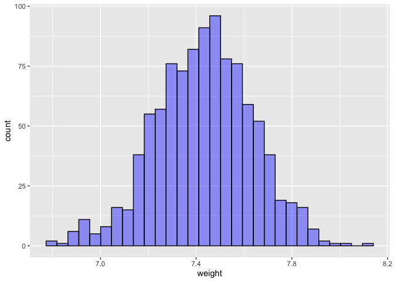

Lab 11 - Smoking during pregnancy
================
Conor Lacey
03/27/2023

### Load packages and data

``` r
suppressWarnings(library(tidyverse)) 
suppressWarnings(library(openintro))
suppressWarnings(library(skimr))
suppressWarnings(library(Hmisc))
suppressWarnings(library(infer))
```

### Exercise 1

``` r
set.seed(4215)
data("ncbirths")

skim(ncbirths)
```

|                                                  |          |
|:-------------------------------------------------|:---------|
| Name                                             | ncbirths |
| Number of rows                                   | 1000     |
| Number of columns                                | 13       |
| \_\_\_\_\_\_\_\_\_\_\_\_\_\_\_\_\_\_\_\_\_\_\_   |          |
| Column type frequency:                           |          |
| factor                                           | 7        |
| numeric                                          | 6        |
| \_\_\_\_\_\_\_\_\_\_\_\_\_\_\_\_\_\_\_\_\_\_\_\_ |          |
| Group variables                                  | None     |

Data summary

**Variable type: factor**

| skim_variable  | n_missing | complete_rate | ordered | n_unique | top_counts         |
|:---------------|----------:|--------------:|:--------|---------:|:-------------------|
| mature         |         0 |             1 | FALSE   |        2 | you: 867, mat: 133 |
| premie         |         2 |             1 | FALSE   |        2 | ful: 846, pre: 152 |
| marital        |         1 |             1 | FALSE   |        2 | mar: 613, not: 386 |
| lowbirthweight |         0 |             1 | FALSE   |        2 | not: 889, low: 111 |
| gender         |         0 |             1 | FALSE   |        2 | fem: 503, mal: 497 |
| habit          |         1 |             1 | FALSE   |        2 | non: 873, smo: 126 |
| whitemom       |         2 |             1 | FALSE   |        2 | whi: 714, not: 284 |

**Variable type: numeric**

| skim_variable | n_missing | complete_rate |  mean |    sd |  p0 |   p25 |   p50 |   p75 |  p100 | hist  |
|:--------------|----------:|--------------:|------:|------:|----:|------:|------:|------:|------:|:------|
| fage          |       171 |          0.83 | 30.26 |  6.76 |  14 | 25.00 | 30.00 | 35.00 | 55.00 | ▃▇▇▂▁ |
| mage          |         0 |          1.00 | 27.00 |  6.21 |  13 | 22.00 | 27.00 | 32.00 | 50.00 | ▃▇▇▂▁ |
| weeks         |         2 |          1.00 | 38.33 |  2.93 |  20 | 37.00 | 39.00 | 40.00 | 45.00 | ▁▁▁▇▂ |
| visits        |         9 |          0.99 | 12.10 |  3.95 |   0 | 10.00 | 12.00 | 15.00 | 30.00 | ▂▇▇▁▁ |
| gained        |        27 |          0.97 | 30.33 | 14.24 |   0 | 20.00 | 30.00 | 38.00 | 85.00 | ▂▇▅▁▁ |
| weight        |         0 |          1.00 |  7.10 |  1.51 |   1 |  6.38 |  7.31 |  8.06 | 11.75 | ▁▁▇▇▁ |

``` r
ncbirths_num <- ncbirths %>% select_if(is.numeric)
hist.data.frame(ncbirths_num)
```

<!-- -->

Variables mature, premie, marital, lowbirthweight, gender, habit, and
whitemom are categorical.

Variables fage, mage, weeks, visits, gained, and weight are numerical.

It also appears from the histograms that visits and weeks have some
outliers.

### Exercise 2

``` r
ncbirths_white <- ncbirths %>% filter(whitemom == "white")
mean(ncbirths_white$weight)
```

    ## [1] 7.250462

### Exercise 3

I believe so. We are wanting to know whether the average weight of
Caucasian babies has changed since 1995. However, we only have a sample
of data, but we can use this sample to *infer* what is happening in the
population. We can also resample from this multiple times and do a
bootstap (a simulation) to make this inference.

``` r
avg<-c(NA)
for (i in 1:1000){
x <- sample(ncbirths_white$weight, size = 50, replace = TRUE)
avg[i]<-mean(x)
}
df_weight <- data.frame(avg = avg)
df_weight <- df_weight %>% mutate(avg =(avg + (7.43-mean(ncbirths_white$weight))))

df_weight %>% ggplot(aes(x = avg)) +
  geom_histogram(color = "black",fill = "blue", alpha = 0.4) +
  xlab("weight")
```

    ## `stat_bin()` using `bins = 30`. Pick better value with `binwidth`.

<!-- -->

``` r
sum((df_weight$avg <= (mean(ncbirths_white$weight))) / length(df_weight$avg)) +
sum((df_weight$avg >= (7.43+(7.43-mean(ncbirths_white$weight)))) / length(df_weight$avg))
```

    ## [1] 0.37

### Exercise 4

For a two-tailed test we would get a p-value of 0.37. This is given by
that the probability of getting a difference between the null and
observed value in the negative direction is .183 and the probability of
getting a difference between the null and observed value in the positive
direction is .187.

This p-value indicates that there has not been a significant change in
the average birth weight of Caucasian babies since 1995.

### Exercise 5

``` r
ncbirths %>% na.omit(cols = "habit") %>% ggplot(aes(y = weight, color = habit)) +
  geom_boxplot()
```

<!-- -->

Individuals whose mothers smoke tend to have lower birth weights.

### Exercise 6

``` r
ncbirths_habitgiven <- ncbirths %>% na.omit(cols = "habit")

ncbirths_habitgiven %>%
  group_by(habit) %>%
  summarise(mean_weight = mean(weight))
```

    ## # A tibble: 2 × 2
    ##   habit     mean_weight
    ##   <fct>           <dbl>
    ## 1 nonsmoker        7.25
    ## 2 smoker           6.89

### Exercise 7

H0: mu_weight_smoke = mu_weight\_!smoke

H1: mu_weight_smoke ≠ mu_weight\_!smoke

### Exercise 8

Yes. We do not know the true population difference in birth weight of
babies’ mothers who smoked and didn’t smoke. We do have a sample
however, and can make an *inference* as to whether a difference exists
in the population.
