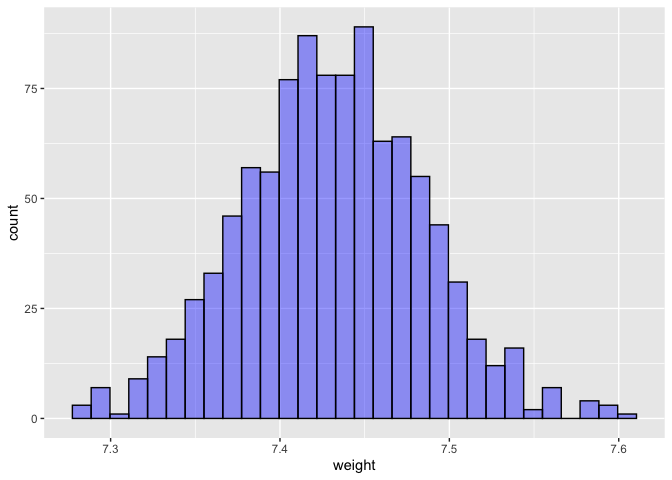

Lab 11 - Smoking during pregnancy
================
Conor Lacey
03/27/2023

### Load packages and data

``` r
suppressWarnings(library(tidyverse)) 
suppressWarnings(library(openintro))
suppressWarnings(library(skimr))
suppressWarnings(library(Hmisc))
suppressWarnings(library(infer))
```

### Exercise 1

``` r
set.seed(4215)
data("ncbirths")

skim(ncbirths)
```

|                                                  |          |
|:-------------------------------------------------|:---------|
| Name                                             | ncbirths |
| Number of rows                                   | 1000     |
| Number of columns                                | 13       |
| \_\_\_\_\_\_\_\_\_\_\_\_\_\_\_\_\_\_\_\_\_\_\_   |          |
| Column type frequency:                           |          |
| factor                                           | 7        |
| numeric                                          | 6        |
| \_\_\_\_\_\_\_\_\_\_\_\_\_\_\_\_\_\_\_\_\_\_\_\_ |          |
| Group variables                                  | None     |

Data summary

**Variable type: factor**

| skim_variable  | n_missing | complete_rate | ordered | n_unique | top_counts         |
|:---------------|----------:|--------------:|:--------|---------:|:-------------------|
| mature         |         0 |             1 | FALSE   |        2 | you: 867, mat: 133 |
| premie         |         2 |             1 | FALSE   |        2 | ful: 846, pre: 152 |
| marital        |         1 |             1 | FALSE   |        2 | mar: 613, not: 386 |
| lowbirthweight |         0 |             1 | FALSE   |        2 | not: 889, low: 111 |
| gender         |         0 |             1 | FALSE   |        2 | fem: 503, mal: 497 |
| habit          |         1 |             1 | FALSE   |        2 | non: 873, smo: 126 |
| whitemom       |         2 |             1 | FALSE   |        2 | whi: 714, not: 284 |

**Variable type: numeric**

| skim_variable | n_missing | complete_rate |  mean |    sd |  p0 |   p25 |   p50 |   p75 |  p100 | hist  |
|:--------------|----------:|--------------:|------:|------:|----:|------:|------:|------:|------:|:------|
| fage          |       171 |          0.83 | 30.26 |  6.76 |  14 | 25.00 | 30.00 | 35.00 | 55.00 | ▃▇▇▂▁ |
| mage          |         0 |          1.00 | 27.00 |  6.21 |  13 | 22.00 | 27.00 | 32.00 | 50.00 | ▃▇▇▂▁ |
| weeks         |         2 |          1.00 | 38.33 |  2.93 |  20 | 37.00 | 39.00 | 40.00 | 45.00 | ▁▁▁▇▂ |
| visits        |         9 |          0.99 | 12.10 |  3.95 |   0 | 10.00 | 12.00 | 15.00 | 30.00 | ▂▇▇▁▁ |
| gained        |        27 |          0.97 | 30.33 | 14.24 |   0 | 20.00 | 30.00 | 38.00 | 85.00 | ▂▇▅▁▁ |
| weight        |         0 |          1.00 |  7.10 |  1.51 |   1 |  6.38 |  7.31 |  8.06 | 11.75 | ▁▁▇▇▁ |

``` r
ncbirths_num <- ncbirths %>% select_if(is.numeric)
hist.data.frame(ncbirths_num)
```

<!-- -->

Variables mature, premie, marital, lowbirthweight, gender, habit, and
whitemom are categorical.

Variables fage, mage, weeks, visits, gained, and weight are numerical.

It also appears from the histograms that visits and weeks have some
outliers.

### Exercise 2

``` r
ncbirths_white <- ncbirths %>% filter(whitemom == "white")
mean(ncbirths_white$weight)
```

    ## [1] 7.250462

### Exercise 3

I believe so. We are wanting to know whether the average weight of
Caucasian babies has changed since 1995. However, we only have a sample
of data, but we can use this sample to *infer* what is happening in the
population. We can also resample from this multiple times and do a
bootstap (a simulation) to make this inference.

``` r
boot_df_weight <- ncbirths_white %>%
  specify(response = weight) %>% 
  generate(reps = 1000, type = "bootstrap") %>% 
  calculate(stat = "mean")

boot_df_weight <- boot_df_weight %>% mutate(stat = (stat + (7.43-mean(ncbirths_white$weight))))

boot_df_weight %>% ggplot(aes(x = stat)) +
  geom_histogram(color = "black",fill = "blue", alpha = 0.4) +
  xlab("weight")
```

    ## `stat_bin()` using `bins = 30`. Pick better value with `binwidth`.

<!-- -->

``` r
sum((boot_df_weight$stat <= (mean(ncbirths_white$weight))) / length(boot_df_weight$stat)) +
sum((boot_df_weight$stat >= (7.43+(7.43-mean(ncbirths_white$weight)))) / length(boot_df_weight$stat))
```

    ## [1] 0

### Exercise 4

For a two-tailed test we would get a p-value of 0. In other words, there
are 0 instances of having a sample mean that is at least as extreme as
the observed sample mean.

This p-value indicates that there has been a significant change in the
average birth weight of Caucasian babies since 1995.

### Exercise 5

``` r
ncbirths %>% na.omit(cols = "habit") %>% ggplot(aes(y = weight, color = habit)) +
  geom_boxplot()
```

<!-- -->

Individuals whose mothers smoke tend to have lower birth weights.

### Exercise 6

``` r
ncbirths_habitgiven <- ncbirths %>% na.omit(cols = "habit")

ncbirths_habitgiven %>%
  group_by(habit) %>%
  summarise(mean_weight = mean(weight))
```

    ## # A tibble: 2 × 2
    ##   habit     mean_weight
    ##   <fct>           <dbl>
    ## 1 nonsmoker        7.25
    ## 2 smoker           6.89

### Exercise 7

H0: mu_weight_smoke = mu_weight\_!smoke

H1: mu_weight_smoke ≠ mu_weight\_!smoke

### Exercise 8

Yes. We do not know the true population difference in birth weight of
babies’ mothers who smoked and didn’t smoke. We do have a sample
however, and can make an *inference* as to whether a difference exists
in the population.

### Exercise 9

``` r
#smoker
boot_df_smoker <- ncbirths_habitgiven %>% 
  filter(habit == "smoker") %>%
  specify(response = weight) %>% 
  generate(reps = 1000, type = "bootstrap") %>% 
  calculate(stat = "mean")

#nonsmoker
boot_df_nonsmoker <- ncbirths_habitgiven %>% 
  filter(habit == "nonsmoker") %>%
  specify(response = weight) %>% 
  generate(reps = 1000, type = "bootstrap") %>% 
  calculate(stat = "mean")

boot_df_diff <- (boot_df_nonsmoker$stat-boot_df_smoker$stat) %>% 
  as.data.frame() %>% 
  setNames("MeanDiff")

boot_df_diff_c <- (boot_df_diff$MeanDiff - mean(boot_df_diff$MeanDiff)) %>% 
  as.data.frame() %>% 
  setNames("MeanDiff")

sum((boot_df_diff_c$MeanDiff >= mean(boot_df_diff$MeanDiff))/length(boot_df_diff_c$MeanDiff)) +
sum((boot_df_diff_c$MeanDiff <= (mean(boot_df_diff$MeanDiff)*-1))/length(boot_df_diff_c$MeanDiff))
```

    ## [1] 0.019

The p-value is 0.019. There is evidence to show that there is a
difference in birth weight of babies whose mothers smokes versus don’t
smoke.

### Exercise 10

``` r
boot_df_diff_c %>%
  summarise(lower = quantile(MeanDiff, 0.025),
            upper = quantile(MeanDiff, 0.975))
```

    ##        lower     upper
    ## 1 -0.2859503 0.3235019

### Exercise 11

``` r
ncbirths %>% filter(mature == "mature mom") %>% 
  filter(mage == min(mage)) %>% 
  select(mage, mature)
```

    ## # A tibble: 35 × 2
    ##     mage mature    
    ##    <int> <fct>     
    ##  1    35 mature mom
    ##  2    35 mature mom
    ##  3    35 mature mom
    ##  4    35 mature mom
    ##  5    35 mature mom
    ##  6    35 mature mom
    ##  7    35 mature mom
    ##  8    35 mature mom
    ##  9    35 mature mom
    ## 10    35 mature mom
    ## # … with 25 more rows

The cut off is 35. Once you hit 35 you are labeled a mature mom.
According to the data set the minimum age to qualify to be a mature mom
is 35.

### Exercise 12

lo_mature = proportion of low birth weight babies of mature mothers

lo_young = proportion of low birth weight babies of young mothers

H0: lo_mature = lo_young

H1: lo_mature \> lo_young

We will run an inference test. We don’t know how the proportions of low
birth weight babies compare between young and mature mothers in the
population, but we can *infer* this from the sample we have.

``` r
#data sets
df_lo_mature <- ncbirths %>% filter(mature == "mature mom")
df_lo_young <- ncbirths %>% filter(mature == "younger mom") 

#Observed value
lo_mature <- sum((df_lo_mature$lowbirthweight == "low")/(nrow(df_lo_mature)))
lo_young <- sum((df_lo_young$lowbirthweight == "low")/(nrow(df_lo_young)))
obs <- lo_mature - lo_young

#Bootstrap 
boot_mat <- df_lo_mature %>% 
  specify(response = lowbirthweight, success = "low") %>% 
  generate(reps = 1000, type = "bootstrap") %>% 
  calculate(stat = "prop")

boot_yug <- df_lo_young %>% 
  specify(response = lowbirthweight, success = "low") %>% 
  generate(reps = 1000, type = "bootstrap") %>%
  calculate(stat = "prop")

prop_diff <- (boot_mat$stat - boot_yug$stat) %>% as.data.frame() %>% 
  setNames("stat")

#Run Test 
prop_diff_c <- (prop_diff$stat - mean(prop_diff$stat)) %>% as.data.frame() %>% #re-center at null
  setNames("stat")

sum((prop_diff_c$stat >= obs)/(nrow(prop_diff_c)))
```

    ## [1] 0.184

The p-value is 0.184. Based on this, we do not have any evidence that
there is a difference in proportions of low birth weight babies between
mature and young mothers.

### Exercise 13

``` r
prop_diff %>%
  summarise(lower = quantile(stat, 0.025),
            upper = quantile(stat, 0.975))
```

    ##         lower      upper
    ## 1 -0.02682311 0.08874999

We can be 95% confident that the true population difference in
proportions of low birth weight babies between mature and young mothers
is between -0.03 and 0.09.
